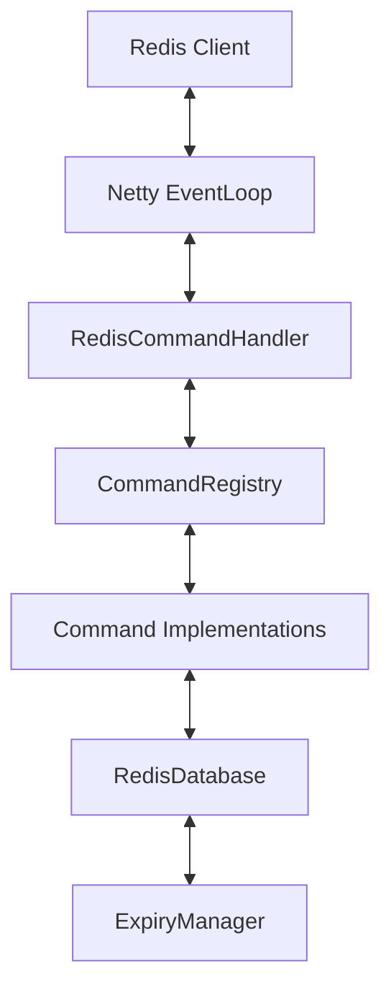

# 🚀 Java Redis Server

[](https://openjdk.java.net/)
[](LICENSE)
[](#)

A high-performance, lightweight, in-memory Redis-compatible server built from the ground up using **Java 25** and **Netty**. This project implements core Redis functionality with a focus on low latency, efficient memory usage, and clean architecture.

---

## ✨ Features

- **⚡ High Performance**: Built on Netty's asynchronous event-driven framework for massive concurrency.
- **💾 In-Memory Storage**: Optimized data structures using `ConcurrentHashMap` for thread-safe, lock-free reads.
- **🔌 Redis Protocol (RESP)**: Implements the Redis Serialization Protocol, compatible with any standard Redis client (`redis-cli`, `jedis`, `redis-py`, etc.).
- **⏳ Advanced Expiration**: Dual-strategy expiration (Lazy + Active background cleanup via `DelayQueue`).
- **🎯 Single-Threaded Execution**: Primarily single-threaded command execution for predictable behavior; note that some blocking commands (e.g., `BLPOP`) currently block the I/O thread and do **not** yet match Redis's non-blocking event-driven handling.
- **🏗️ Extensible Command Registry**: Easy to add new commands via a simple interface.

---

## 🛠️ Supported Commands

### 🔑 Connection & Utility
| Command | Usage | Description |
|:---|:---|:---|
| `PING` | `PING [message]` | Returns `PONG` or the provided message. |
| `ECHO` | `ECHO message` | Returns the provided message. |
| `EXPIRE` | `EXPIRE key seconds` | Set a timeout on a key. |
| `TTL` | `TTL key` | Get the time to live for a key in seconds. |

### 📝 Key-Value Operations
| Command | Usage | Description |
|:---|:---|:---|
| `SET` | `SET key value [EX s] [PX ms] [NX\|XX]` | Set key to value with optional TTL and conditions. |
| `GET` | `GET key` | Get the value of a key. |
| `DEL` | `DEL key [key ...]` | Delete one or more keys. |

### 📋 List Operations
| Command | Usage | Description |
|:---|:---|:---|
| `LPUSH` | `LPUSH key element [element ...]` | Prepend one or multiple elements to a list. |
| `RPUSH` | `RPUSH key element [element ...]` | Append one or multiple elements to a list. |
| `LPOP` | `LPOP key [count]` | Remove and get the first element(s) of a list. |
| `LLEN` | `LLEN key` | Get the length of a list. |
| `LRANGE` | `LRANGE key start stop` | Get a range of elements from a list. |
| `BLPOP` | `BLPOP key [key ...] timeout` | Remove and get the first element in a list, or block. |

---

## 🚀 Getting Started

### Prerequisites
- **JDK 25** or higher (with `--enable-preview`)
- **Maven 3.9+**

### Build & Run
```bash
# Clone and build (replace REPO_URL with the HTTPS or SSH URL of this repository or your fork)
git clone REPO_URL
cd redis-java
mvn clean package

# Start the server
java --enable-preview -jar target/redis-server.jar
```

The server listens on port **6379** by default.

### Connect with `redis-cli`
```bash
redis-cli -p 6379
127.0.0.1:6379> PING
PONG
127.0.0.1:6379> SET framework "Netty"
OK
127.0.0.1:6379> GET framework
"Netty"
```

---

## 🏗️ Architecture



- **Netty Layer**: Handles I/O multiplexing and protocol framing.
- **Command Registry**: Decouples the protocol handler from command logic.
- **Storage Layer**: Managed `ConcurrentHashMap` with TTL support.
- **Expiry Manager**: Background thread using a `DelayQueue` for $O(\log n)$ queue-based scheduling plus average $O(1)$ map access during expiration.

---

## 🧪 Testing

We maintain high confidence through both unit and integration tests.

```bash
# Run all tests (Unit + Integration)
./run_all_tests.sh

# Run only unit tests
mvn test
```

---

## ⚙️ Configuration

Edit `src/main/resources/application.properties`:

| Property | Default | Description |
|:---|:---|:---|
| `redis.port` | 6379 | Port to listen on. |
| `redis.boss.threads` | 1 | Number of acceptor threads. |
| `redis.worker.threads` | 1 | Number of I/O threads (Keep at 1 for Redis semantics). |

---

## 📄 License
Distributed under the MIT License. See `LICENSE` for more information.

