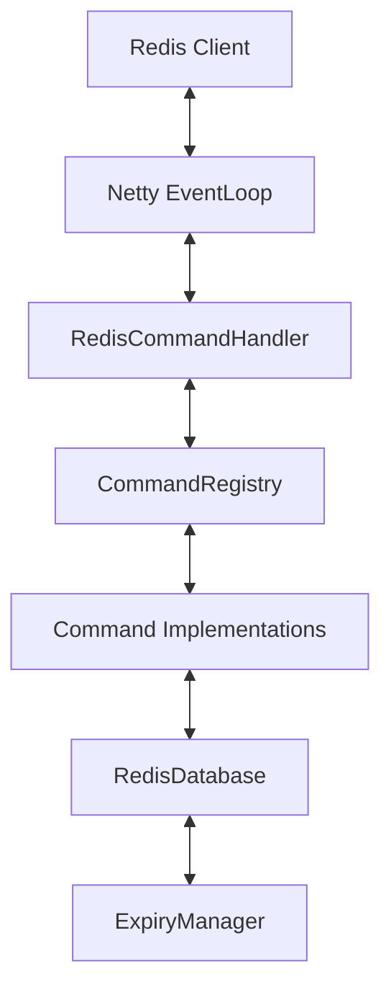

# 🚀 Java Redis Server

[](https://openjdk.java.net/)
[](LICENSE)
[](https://github.com/unikdahal/redis-java/actions/workflows/ci.yml)

A high-performance, lightweight, in-memory Redis-compatible server built from the ground up using **Java 25** and **Netty**. This project implements core Redis functionality with a focus on low latency, efficient memory usage, and clean architecture.

---

## ✨ Features

- **⚡ High Performance**: Built on Netty's asynchronous event-driven framework for massive concurrency.
- **💾 In-Memory Storage**: Optimized data structures using `ConcurrentHashMap` for thread-safe, lock-free reads.
- **🔌 Redis Protocol (RESP)**: Implements the Redis Serialization Protocol, compatible with any standard Redis client (`redis-cli`, `jedis`, `redis-py`, etc.).
- **⏳ Advanced Expiration**: Dual-strategy expiration (Lazy + Active background cleanup via `DelayQueue`).
- **🔄 Transaction Support**: Full MULTI/EXEC/DISCARD support with optimized batch execution and zero-contention state management.
- **🎯 Single-Threaded Execution**: Primarily single-threaded command execution for predictable behavior; blocking commands (e.g., `BLPOP`) are handled asynchronously using Netty's event loop to avoid blocking I/O.
- **🏗️ Extensible Command Registry**: Easy to add new commands via a simple interface.

---

## 🛠️ Supported Commands

Detailed documentation for each command can be found in the [docs/commands](./docs/commands) directory.

### 🔑 Connection & Utility
| Command | Usage | Documentation |
|:---|:---|:---|
| `PING` | `PING [message]` | [PING.md](./docs/commands/PING.md) |
| `ECHO` | `ECHO message` | [ECHO.md](./docs/commands/ECHO.md) |
| `EXPIRE` | `EXPIRE key seconds` | [EXPIRE.md](./docs/commands/EXPIRE.md) |
| `TTL` | `TTL key` | [TTL.md](./docs/commands/TTL.md) |
| `TYPE` | `TYPE key` | [TYPE.md](./docs/commands/TYPE.md) |

### 📝 Key-Value Operations
| Command | Usage | Documentation |
|:---|:---|:---|
| `SET` | `SET key value [EX s] [PX ms] [NX\|XX]` | [SET.md](./docs/commands/SET.md) |
| `GET` | `GET key` | [GET.md](./docs/commands/GET.md) |
| `DEL` | `DEL key [key ...]` | [DEL.md](./docs/commands/DEL.md) |
| `INCR` | `INCR key` | [INCR.md](./docs/commands/INCR.md) |

### 🔄 Transactions
| Command | Usage | Documentation |
|:---|:---|:---|
| `MULTI` | `MULTI` | [MULTI.md](./docs/commands/MULTI.md) |
| `EXEC` | `EXEC` | [EXEC.md](./docs/commands/EXEC.md) |
| `DISCARD` | `DISCARD` | [DISCARD.md](./docs/commands/DISCARD.md) |

### 📋 List Operations
| Command | Usage | Documentation |
|:---|:---|:---|
| `LPUSH` | `LPUSH key element [element ...]` | [LPUSH.md](./docs/commands/LPUSH.md) |
| `RPUSH` | `RPUSH key element [element ...]` | [RPUSH.md](./docs/commands/RPUSH.md) |
| `LPOP` | `LPOP key [count]` | [LPOP.md](./docs/commands/LPOP.md) |
| `LLEN` | `LLEN key` | [LLEN.md](./docs/commands/LLEN.md) |
| `LRANGE` | `LRANGE key start stop` | [LRANGE.md](./docs/commands/LRANGE.md) |
| `BLPOP` | `BLPOP key [key ...] timeout` | [BLPOP.md](./docs/commands/BLPOP.md) |

### 🌊 Stream Operations
| Command | Usage | Documentation |
|:---|:---|:---|
| `XADD` | `XADD key ID field value [field v ...]` | [XADD.md](./docs/commands/XADD.md) |
| `XRANGE` | `XRANGE key start end [COUNT c]` | [XRANGE.md](./docs/commands/XRANGE.md) |
| `XREAD` | `XREAD [COUNT c] [BLOCK ms] STREAMS k [k ...] id [id ...]` | [XREAD.md](./docs/commands/XREAD.md) |

---

## 🚀 Getting Started

### Prerequisites
- **JDK 25** or higher (with `--enable-preview`)
- **Maven 3.9+**

### Build & Run
```bash
# Clone and build (replace REPO_URL with the HTTPS or SSH URL of this repository or your fork)
git clone REPO_URL
cd redis-java
mvn clean package

# Start the server
java --enable-preview -jar target/redis-server.jar
```

The server listens on port **6379** by default.

### Connect with `redis-cli`
```bash
redis-cli -p 6379
127.0.0.1:6379> PING
PONG
127.0.0.1:6379> SET framework "Netty"
OK
127.0.0.1:6379> GET framework
"Netty"
```

---

## 🏗️ Architecture



- **Netty Layer**: Handles I/O multiplexing and protocol framing.
- **Command Registry**: Decouples the protocol handler from command logic.
- **Storage Layer**: Managed `ConcurrentHashMap` with TTL support.
- **Expiry Manager**: Background thread using a `DelayQueue` for $O(\log n)$ queue-based scheduling plus average $O(1)$ map access during expiration.

---

## 🧪 Testing

We maintain high confidence through both unit and integration tests.

```bash
# Run all tests (Unit + Integration)
./run_all_tests.sh

# Run only unit tests
mvn test

# Run only integration tests
mvn verify -DskipUnitTests
```

---

## 🔒 CI/CD & Branch Protection

This repository enforces **mandatory passing tests** before any PR can be merged:

- ✅ **Build** must compile successfully
- ✅ **Unit Tests** must all pass (469+ tests)
- ✅ **Integration Tests** must all pass (179+ tests)

The CI pipeline runs automatically on every push and PR. See [Branch Protection Setup](./docs/BRANCH_PROTECTION.md) for configuration details.

---

## ⚙️ Configuration

Edit `src/main/resources/application.properties`:

| Property | Default | Description |
|:---|:---|:---|
| `redis.port` | 6379 | Port to listen on. |
| `redis.boss.threads` | 1 | Number of acceptor threads. |
| `redis.worker.threads` | 1 | Number of I/O threads (Keep at 1 for Redis semantics). |

---

## 📄 License
Distributed under the MIT License. See `LICENSE` for more information.

